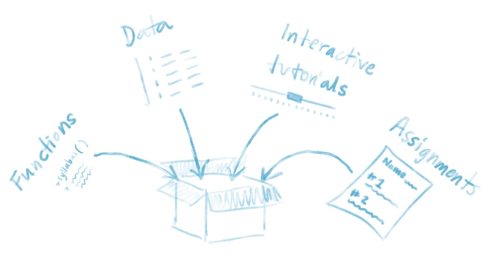

```{r setup, include=FALSE}
knitr::opts_chunk$set(echo = TRUE)
```
# Is this tutorial for you?
**Pre-requisites:**

1) You have a github account
2) You are comfortable with the basics of using R and RStudio
3) You understand how R projects work
4) You understand the difference between a regular R script and an R Markdown document

[^ refine with j hester's descriptions from talk]

**What you'll learn:**

1) How to make a package that your students can download and install from github
2) How to include a raw data set in your package
3) How to create a custom template in your package that your learners can use for worksheets, training materials, assigment templates, etc
4) How to give your students access to a custom interactive tutorial/lesson

<br>

# Why make a package?

<center>{width=600px}</center>

<br>

As an educator you can use a package to easily deliver the contents of your lesson/ teaching material/ data to an audience. Your package doesn't have to be on CRAN, and it doesn't have to contain functions (but it can if you want!). Packages can be used creatively so that you can give your students custom data sets to work with, R Markdown "worksheets" that they can fill in or use as templates for completing exercises. You can also have students run LearnR tutorials with a package. These are interactive R Markdown docs that use Shiny.

# So you wanna make a package?
<br>
## Getting started

Need to install and load the following: 

```{r, eval=FALSE}
#install.packages(c("devtools", "roxygen2", "usethis"))
library(devtools)
library(roxygen2)
library(usethis)
```

<br>

### You're not on your own
Making a package involves creating an R project with several specific folders containing scripts and other intermediate files. We could create these folders manually, but we don't have to! There are some helper functions that streamline this folder-creation and organization process for us to make sure these files end up in the right place. (I know because I tried not using the helper functions, and my files got all sorts of messed up.)


<div class= "alert alert-note">
> **A little more info:**  What are these for? `devtools` is used to _______ & ________. The `roxygen2` package is going to makes sure that your descriptions for each part of your package are formatted properly. The `usethis` package automates the creation of folders and intermediate files so that you don't have to accidentally put stuff in the wrong place.

</div>

<br>

### A little bit more setup

To make the `usethis` package maximally helpful to us during our package creation, we should complete a few more setup steps. Below we summarize the more thorough `usethis` instructions found [here](https://usethis.r-lib.org/articles/articles/usethis-setup.html):

<br>
**Modify your .Rprofile:** 
Here, we'll (1) tell R to make `devtools` available anytime you're doing interactive work [IS THIS RIGHT?] and (2) give R some information about how to automatically fill in fields that require default information from us (i.e. our name, email, etc.)

  * Call `usethis::use_devtools()` and see that a `.Rprofile` script pops up.
  * Paste the following into your `.Rprofile` script:
```{r, eval=FALSE}
    if (interactive()) {
      suppressMessages(require(devtools))
    }
```
  * Save and re-start your R session
  * Call `usethis::edit_r_profile()` to re-open your `.Rprofile`
  * Add the following to your `.Rprofile` script and modify any of the options to include your information. ([ORCID](https://orcid.org/) is another form of digital identification, and you can register for a free ID number on their site). 
    ```{r, eval=FALSE}
    options(
      usethis.full_name = "Jane Doe",
      usethis.description = list(
        `Authors@R` = 'person("Jane", "Doe", email = "jane@example.com", role = c("aut", "cre"), 
        comment = c(ORCID = "YOUR-ORCID-ID"))', 
        License = "MIT + file LICENSE",
        Version = "0.0.0.9000"
      ),
      usethis.protocol  = "ssh"
    )
    ```
  * Save and re-start your R session

<br>
**Get and store a GitHub personal access token** [Rephrase]
In the steps below we generate a personal access token (PAT, i.e. a very long ID code) that `usethis` will need to communicate with github [???]. We will store this long ID in a file `.Renviron` as a variable called `GITHUB_PAT`. See below:

  * `usethis::browse_github_token()`: Generates a token. *Save this token somewhere.* Not a huge deal if you lose this, but you will have to generate and save a new one if you do.
  * `usethis::edit_r_environ()`: Opens `.Renviron`
  * Paste `GITHUB_PAT = ` followed by your PAT into `.Renviron`
  * Enter a new line after this variable. (Common mistake is to omit this.) 
  * Save and restart R and confirm that your PAT is now available with `git_sitrep()`

<br>

### Create and name your minimally viable package
This is going to make the github repository and create an active project, all in the following lines of code. Whatever you name your directory is what your package will be named. Replace `your-package-name` with whatever you'd like to call your package.

```{r, eval=FALSE}
create_package("~/Desktop/your-package-name")
use_git()
use_github()
  

```

This will output a lot of stuff on your console, creating folders and files where they need to be created.

[replace SCREENSHOT OF WHAT THIS LOOKS LIKE]


<br>

### What are these folders?

[high-level overview of what each of these folders will house?, annotation?]

* **Modify the DESCRIPTION file**: Make sure that the author, title, and description fields are correct.
* **License the package**: [OPTIONAL?] How can others who find your material use it? You can run one of the following commands to fill in this field appropriately:
    * `use_mit_license()`
    * `use_gpl3_license()`
    * `use_apl2_license()`
    * `use_cc0_license()`
* **Create a `README.Rmd`:** You can modify and knit this file like any other README
    


<br>

### Build and install

Check that your new package works by clicking on `Install and Build` under the Build tab.


# Make a function
As an educator, you probably won't be using packages much to create custom functions, but as a quick exercise to show that your package works and can be installed. Let's make one here that prints 


# Including data sets
What if you'd like your students to work with a specific data set. Should you email them an excel or .csv file? NO! You can include data sets in your package, ready to be summoned with the call of an object name.  

[graphic for how to do this]

FYI: Folders that will be generated that you'll be working with
- **Data:** 
- **Data-raw:** This folder is where you can put all of your stuff. Scripts, csv files, whatever you want. 
- **man:** This folder will contain intermediate output. You won't need to use the files in here directly, but they need to exist.
- **R**: This is where your usable, callable data set will end up.

<br>
### Step 1

```{r, eval=FALSE}
use_data_raw()

```


<br>
### Install
```{r, eval=FALSE}
# install.packages("remotes")
remotes::install_github("your-github-name/your-repository-name")

```

<br>

```{r, eval=FALSE}
summary(cars)
```

<br>


# Including a template .Rmd file. 

What is an .Rmd template and why would you want to make one?

An .Rmd template is essentially the replacement for a worksheet. It is a partially-filled out .Rmd that you create. You can create a template for every hw assignment or exercise that you want your students to work through. And they can access all of these templates easily when they go to create a new .Rmd file. They just select the appropriate template. 

To make one your first template, you will:

1) use a usethis function `use_rmarkdown_template()` to spit out the different files and folders you need all in the write places
2) You'll modify the template.
3) 

```{r, eval=FALSE}

use_rmarkdown_template(template_name = "Template Name")

```

# Including learnR tutorials

**Folders added
- This will add a inst folder to your package project directory

```{r, eval=FALSE}
remotes::install_github("rstudio/learnr")
use_tutorial("Lesson1", "Lesson1", open = interactive())
```

After running the code above, I got a really long wait time with something that said "Loading required package: shiny / Listening on http://127.0.0.1:5525" After getting tired of waiting, I clicked "STOP" and the tutorial loaded. Weird.


# Troubleshooting
If you run into rough patches, here are some common pitfalls that might be resulting in errors:

* Do you have most up-to-date version of your packages? Try installing the development version of the package from github. Here's an example of what that looks like for the `usethis` package.
```{r, eval=FALSE}
# install.packages("devtools")
devtools::install_github("r-lib/usethis")
```

* Are you running the most current version of R and/or RStudio?

* Did you install R via homebrew? --> Uninstall and install from CRAN!
